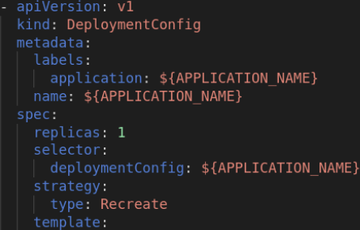

# Workshop JBoss EAP on Openshift

## Prerequisites
This workshop requieres an OpenTLC instance deployed.

## Operation

1. Install OC Client.
    - Download OC: http://d3s3zqyaz8cp2d.cloudfront.net/pub/openshift-v4/clients/ocp/4.6.20/openshift-client-linux-4.6.20.tar.gz
      * [oc client folder](./tools/oc-client/)
    - Copy on your PATH
    - Run: oc version

2. Cluster login:
    - Go to cluster and login as cluster-admin: https://console-openshift-console.apps.cluster-58b1.dynamic.opentlc.com/dashboards
      * Cluster admin: user: admin , password: pU8uNdrpviUgbRrH
      * Users:  user1 .. user10, password: BAqpz5uVc33Quqf5
    - Click on user button (upper rigth), and click 'Copy login command'
    - Copy the login command shown.
    - Paste on your terminal: oc login --token=TOKEN --server=https://api.cluster-58b1.dynamic.opentlc.com:6443

3. Basic Operations:
    - Whoami / Token: 
      * oc whoami -t
    - Projects / Namespaces:
      * oc projects (list all projects)
      * oc project PROJECT_NAME: oc new-project eap-demo-$MY_USER
    - New application:
      * oc new-build IMAGE_NAME~SOURCE_CODE --name BUILD_NAME: oc new-build nodejs~https://github.com/cesarvr/hello-world-nodejs --name nodejs-build
      * oc new-app nodejs-build --name=my-nodejs-app
      * oc expose service/my-nodejs-app  (create a route)
    - Get / Describe Objects:
      * oc get all
      * oc get OBJECT_TYPE (list): oc get bc
      * oc get OBJECT_TYPE OBJECT_NAME -o yaml -n PROJECT_NAME: 
        * oc get bc nodejs-build -o yaml
        * oc get bc nodejs-build -o yaml > nodejs-build.yaml
    - Edit Objects:
      * oc edit OBJECT_TYPE OBJECT_NAME: oc edit bc nodejs-build
    - Create / Delete objects from file:
      * oc create -f FILE_NAME: oc create -f nodejs-build.yaml
      * oc delete -f FILE_NAME: oc delete -f nodejs-build.yaml

## Deploy
1. Working with JBoss EAP for OpenShift Imagestreams and Templates
    - Work in namespaces previously created 'eap-demo-$MY_USER'
      * oc project eap-demo-$MY_USER
    - If you are using any HTTPS-enabled features, create a keystore and a secret (ex: using eap73-https-s2i template for JDK 8)
      * Create keystore:
        + keytool -genkey -keyalg RSA -alias my-kesystore -keystore my-keystore-file.jks -validity 360 -keysize 2048
      * Create a secret: 
        + oc secrets new my-keystore-secret my-keystore-file.jks
    - Configure Authentication to the Red Hat Container Registry
      On Red Hat Customer Portal, create [an authentication token using a registry service account.](https://access.redhat.com/RegistryAuthentication)
      * Create the authentication token secret for your OpenShift project using the YAML file
        + oc create -f myserviceaccount-secret.yaml
      * Assign the secret to default and builder service accounts:
        + oc secrets link default myserviceaccount-pull-secret --for=pull
        + oc secrets link builder myserviceaccount-pull-secret --for=pull

    - Import the Latest JBoss EAP for OpenShift Imagestreams and Templates
      * for resource in \
          eap73-amq-persistent-s2i.json \
          eap73-amq-s2i.json \
          eap73-basic-s2i.json \
          eap73-https-s2i.json \
          eap73-image-stream.json \
          eap73-sso-s2i.json \
          eap73-starter-s2i.json \
          eap73-third-party-db-s2i.json \
          eap73-tx-recovery-s2i.json
        do
          oc replace -n openshift --force -f \
        https://raw.githubusercontent.com/jboss-container-images/jboss-eap-7-openshift-image/eap73/templates/${resource}
        done
      * Check the [Catalog](https://console-openshift-console.apps.cluster-58b1.dynamic.opentlc.com/catalog) and the [ImageStreams](https://console-openshift-console.apps.cluster-58b1.dynamic.opentlc.com/k8s/ns/openshift/imagestreams)

    - Create a new OpenShift application that uses the JBoss EAP for OpenShift image and the source code of your Java application.
      * oc new-app --template=eap73-basic-s2i \
      -p IMAGE_STREAM_NAMESPACE=eap-demo \
      -p SOURCE_REPOSITORY_URL=https://github.com/jboss-developer/jboss-eap-quickstarts \
      -p SOURCE_REPOSITORY_REF=7.3.x-openshift \
      -p CONTEXT_DIR=kitchensink

      * Check the process 
      
      

      * Objects created: 
     
      
     
      
     
      
     
      
     
      

      
      
    - Launch deploy:
      * oc start-build eap-app

      

    - Fix: Namespace: eap-demo => openshift
      * oc edit bc eap-app
      * oc edit bc eap-app-build-artifacts

      

2. Working with JBoss EAP Operator
  - Install JBoss EAP Operator:
    * Open web console, select 'Administrator view'
    * Select Operators/Installed Operators: must be empty.
      
      

    * Select OperatorHub, apply filter 'eap'. Select 'JBoss EAP'
      
      

    * Select 'JBoss EAP Operator', click Install button.
      An installation form is shown, then select:
        - Update channel: **stable**
        - Installation mode: **A specific namespace...**
        - Installed namespace: **eap-demo-$MY_USER** (project created previously)
      
      Finally click Install. (The installation may take few minutes)
      
      

      

  - Create an instance using JBoss EAP Operator:
    * Click on JBoss EAP Operator installed, then WildflyServer 'create instance' button is displayed.
    
    
  
    Complete fields:
      - Name: the app name
      - Replicas: number of instances
      - Application Name: image-registry.openshift-image-registry.svc:5000/test-1/eap-app 

    

    * Or create from file:
    
    
    
      - oc create -f ./resources/eap-app-from-operator-wfs.yaml

    Check deleting some objects created with operators...

## Monitoring

  [Monitoring](./monitoring/README.md)

##  Troubleshooting

  [Troubleshooting](./troubleshooting/README.md)

