# Workshop JBoss EAP on Openshift
## Monitoring

In order to show how monitoring works we developed an Application based on Quarkus and Micrometer.
We have 3 steps:
1. Installing Prometheus to collect information.

2. Installing Grafana to use dashboards

3. Adapt our application to generate metrics that will be shown on dashboards.


### Installing Prometheus to collect information.
1. Start the installation using Prometheus Operator.

    Go to Admininistrator view / Operators / Operator Hub and select the Prometheus Operator.

    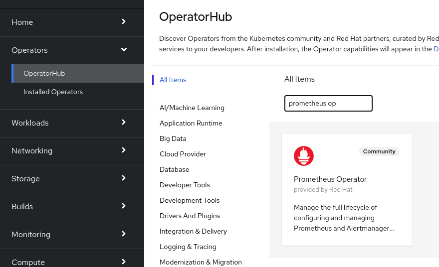

    Then install in your namespace:

    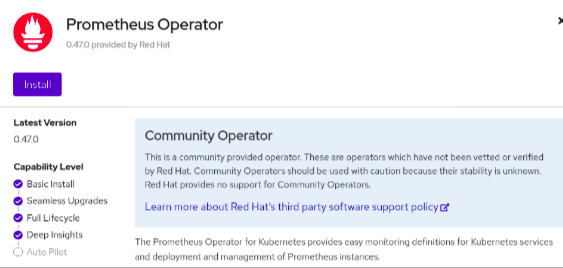

    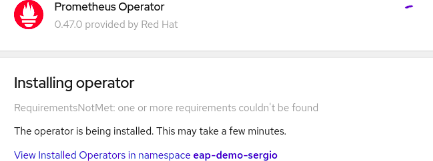

### Installing Grafana to use dashboards
1. Start the installation usiong Grafana Operator...

    Go to Admininistrator view / Operators / Operator Hub and select the Grafana Operator.

    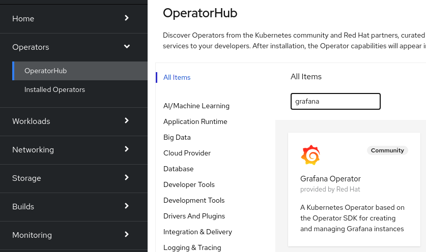

    Then install in your namespace:

    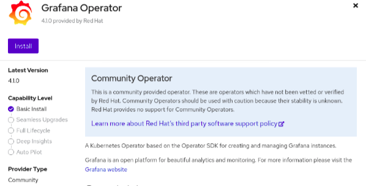

    

2. Setting up Grafana.

     

### Adapt our application

#### Prerrequisites
1. Maven:
    - You need Maven 3.6 installed on your machine. Go to the following link (https://maven.apache.org/download.cgi), download and install de version according to you OS.

2. Java 11:
    - You can follow this link (https://developers.redhat.com/openjdk-install) in order to install OpenJDK11.


3. If you want to start deveLoping Quarkus applications an easy way to do it is using JBANG.

    - Install:
    ```shell script
    curl -Ls https://sh.jbang.dev | bash -s - app install --fresh --force quarkus@quarkusio
    ```

    An error message is shown, so execute:

    ```shell script
    jbang trust add https://repo1.maven.org/maven2/io/quarkus/quarkus-cli/
    ```

    Something similar to this is shown: 
    ```shell script
    [jbang] Adding [https://repo1.maven.org/maven2/io/quarkus/quarkus-cli/] to /home/splatas/.jbang/trusted-sources.json
    ```


    Execute again the curl command and now you should see this: 
    ```shell script
    [jbang] Command installed: quarkus
    ```

    If you want to learn more about Quarkus, please visit its website: https://quarkus.io/ .

#### Process
1. Clone the repository:
    ```shell script
    git clone https://github.com/splatas/quarkus-metrics

    cd ./quarkus-metrics
    ```

2. Check files:
    - pom.xml:
    
    ```xml
        <dependency>
			<groupId>io.quarkus</groupId>
			<artifactId>quarkus-openshift</artifactId>
		</dependency>

		<dependency>
			<groupId>io.quarkus</groupId>
			<artifactId>quarkus-smallrye-openapi</artifactId>
		</dependency>
		
		<dependency>
		    <groupId>io.quarkus</groupId>
		    <artifactId>quarkus-micrometer-registry-prometheus</artifactId>
		</dependency>
    ```

    - Java class 'ExampleResource' (src/main/java/com/redhat/ExampleResource.java), services: 'getSongs' and 'populateSongs':

    ```java
        @Path("/q-metrics")
        public class ExampleResource {
	        ...
        
            @GET
            @Produces(MediaType.TEXT_PLAIN)
            @Path("/getSongs")
            @Timed("time_get_songs")
            @Counted
            public List<String> getSongs() {
                ...

            @GET
            @Produces(MediaType.TEXT_PLAIN)
            @Path("/populateSongs")
            @Timed("time_populate_songs")
            @Counted
            public List<String> populateSongs() {
                ...

    ```


3. Deploy the application locally:

    ```shell script
    mvn quarkus:dev
    ```

     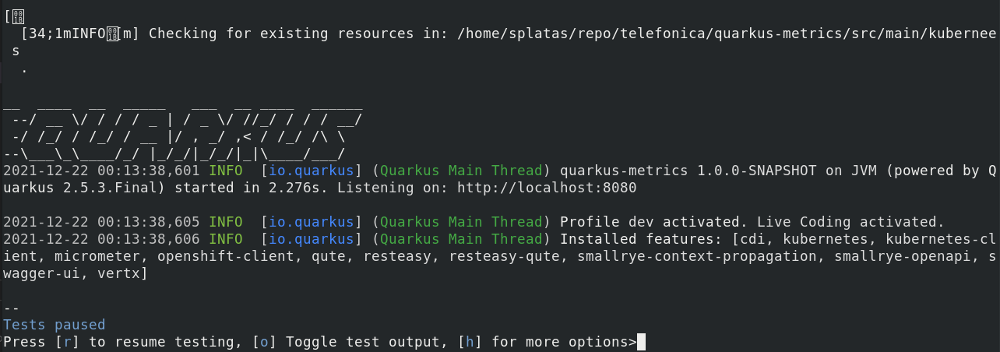

    This command compile, download dependencies and launch the application in DEV mode locally.

4. Deploy the application on Openshift cluster:

    - Login to cluster using credentials:
        ```shell script
        oc login --token=__TOKEN__ --server=https://api.cluster-58b1.dynamic.opentlc.com:6443
        ```    

    - Build, create objects and deploy the app on the cluster:
        ```shell script
        mvn package -Dquarkus.kubernetes-client.master-url=__CLUSTER-URL__ -Dquarkus.kubernetes-client.token=__TOKEN__


        mvn package -DskipTests -Dquarkus.kubernetes-client.master-url=https://api.cluster-58b1.dynamic.opentlc.com:6443 -Dquarkus.kubernetes-client.token=sha256~rsr0JvfMKJ4haHlilO52TSJ8JFEfNpR43MAv8DCaQJE -Dquarkus.kubernetes.deploy=true -Dquarkus.kubernetes-client.trust-certs=true -Dquarkus.openshift.route.expose=true 
        ```
         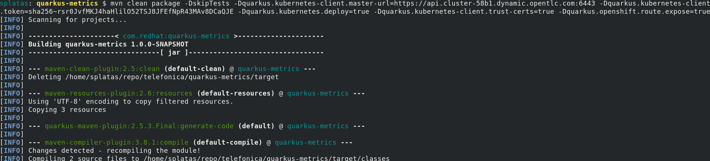

        ...

        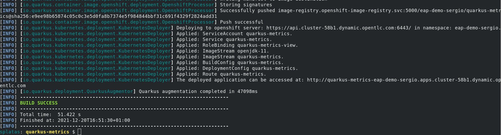


        After that you should see an instance of the application running on your cluster:

        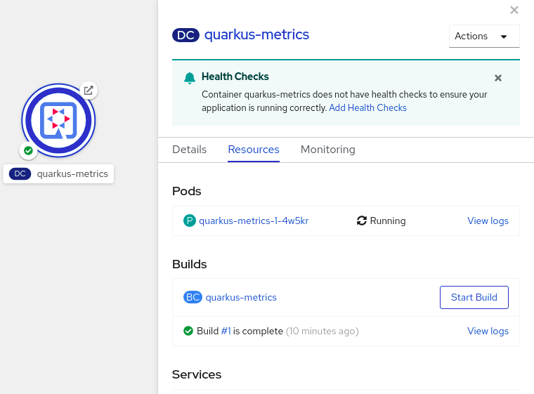


    - Working with the application:
        If you click on the exposed route you will see a page like this:

        Route: http://quarkus-metrics-eap-demo-sergio.apps.cluster-58b1.dynamic.opentlc.com/
        
        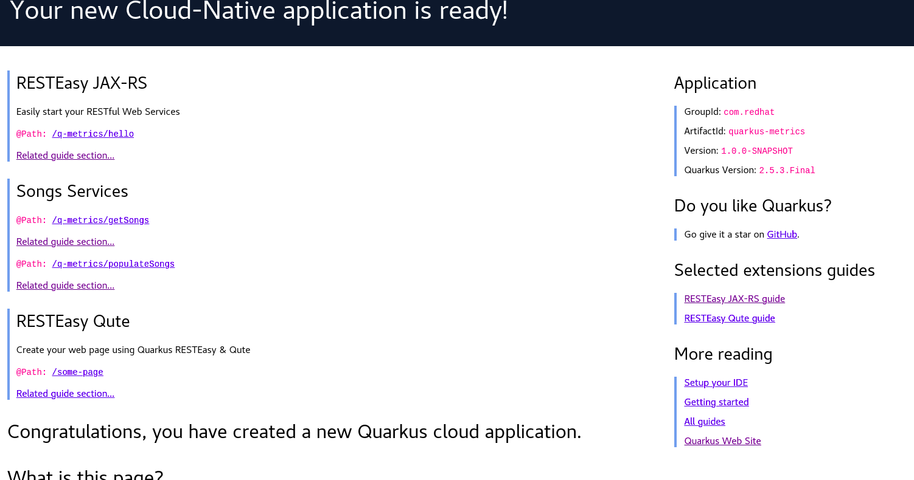
        

        
        You have an Endpoint to see the metrics of this app in raw format:
        http://quarkus-metrics-eap-demo-sergio.apps.cluster-58b1.dynamic.opentlc.com/q/metrics

        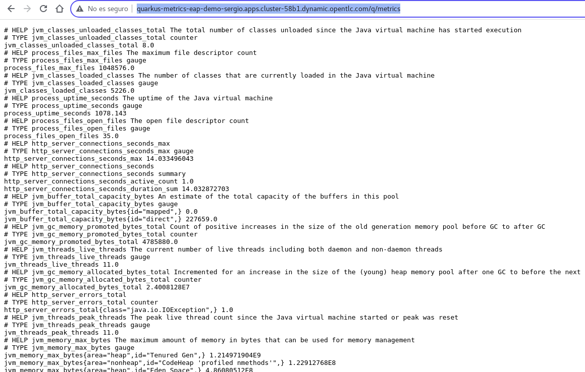

        
        Note that you can find several metrics related to resources used by the application, such as:
        - jvm_classes_loaded_classes
        - jvm_buffer_total_capacity_bytes
        - jvm_gc_memory_promoted_bytes_total
        - jvm_memory_max_bytes
        
        ... among others

    - Custom metrics:
        We added some specific annotations in the application code in order to generate custom metrics of our services.

        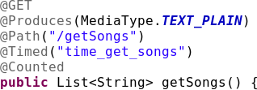

        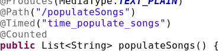

        As you can see there are two annotations called:
            - @Timed
            - @Counted

        Just with those resources you can see metrics of your endpoints, generated easily. When you start to consume those endpoints, the metrics are available on [Metrics Endpoint](http://quarkus-metrics-eap-demo-sergio.apps.cluster-58b1.dynamic.opentlc.com/q/metrics)


        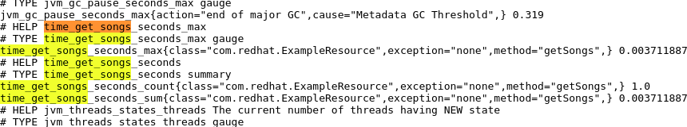

-
-
-


### FIN ------------------------
